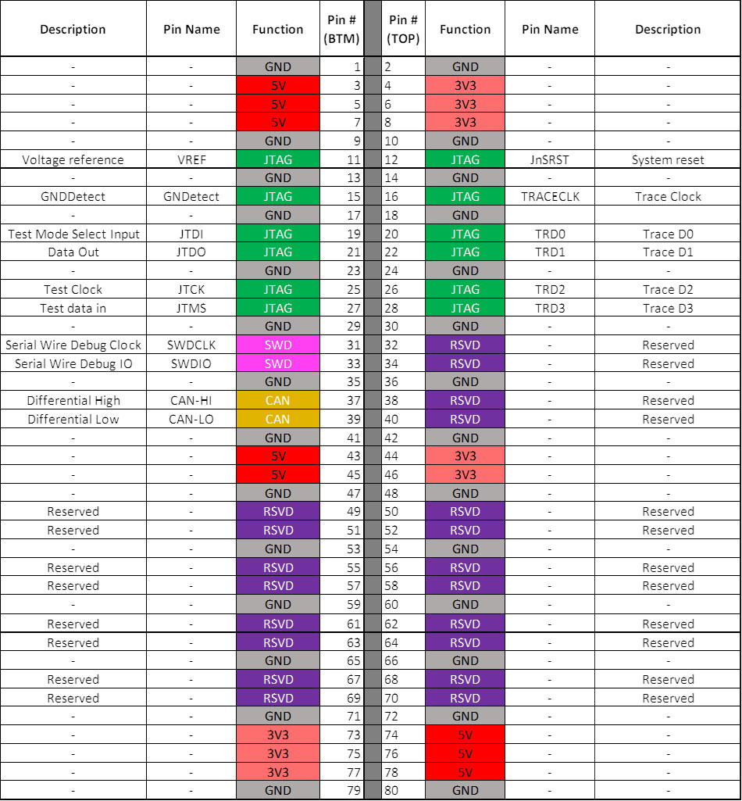

# [TailGator](https://github.com/yomole/TailGator)

# Introduction

The TailGator Interconnect System (TGIS) project aims to produce a modular connection system and standard for easily connecting, replacing, and upgrading underwater robotics hardware in space-constrained robotics designs. 
Several other standards exist for modular electronics hardware, including:

- [Adafruit Feather Specification](https://learn.adafruit.com/adafruit-feather/feather-specification)
- [Sparkfun MicroMod Specification](https://www.sparkfun.com/micromod)
- [Arduino Shield Specificaton](https://learn.sparkfun.com/tutorials/arduino-shields-v2)
- [PCI-e Specification](https://pcisig.com/)

However, no single standard contains the pin density, physical dimensions, signal integrity, power delivery, and cost effectiveness we are looking for. The TailGator Interconnect System aims to solve this problem for the Machine Intelligence Laboratories' [SubjuGator 9 Autonomous Underwater Vehicle](http://subjugator.org/?page_id=3390) platform while making the design open source to help the robotics community.

Our release candidate demonstration can be found here: https://youtu.be/-oDCMslNhLU

# Electrical Specifications

The current design of TGIS can supply:
- 3.3V @ 4A (13.3W)
- 5V @ 4A (20W)

Reserved lines may be used to supplement the 3.3V or 5V lines. Board designs may also include a 5V to 3.3V LDO regulator to suppliment the 3.3V line on a specific board in the system.

## Pinout

# Hardware

Currently, the project contains Altium schematics and layouts for three boards used for power, communications, and alpha-build testing. These can be found in the `PCB/TailGator Interconnect System` folder:
- Power Input Board (`TGIS Main`) **V1**: Accepts power for the 3.3V and 5V rails used for TGIS boards while regulating it against reverse polarity and overvoltage. Also offers overcurrent protection.
- USB to CAN Board (`TGIS USB to CAN`) **V1**: Transcribes USB serial messages into CAN packets that are sent to all connected boards in the TGIS system. This board has inputs for JTAG, external CAN connections using RJ45, and SWD for debugging the board's RP2040 microcontroller.
- Breakout Board (`TGIS Breakout`) **V1**: Allows access to the TGIS connector lines using typical 0.1" (2.54mm) headers. This is going to be used for alpha-build testing of the different features currently implemented across all produced boards.  

Other folders contain incomplete designs for other planned boards.

## Documentation

For those without access to [Altium Designer](https://www.altium.com/altium-designer), [Altium Designer Viewer](https://www.altium.com/altium-designer-viewer), or similar compatible applications, documentation for each produced hardware design is available under the `Project Outputs` folder for each respective project. Links are also provided here for convienience:
- [Power Distribution Board](<PCB/TailGator Interconnect System/TGIS Main/Project Outputs for TGIS Main/TGIS.PDF>)
- [USB to CAN Board](<PCB/TailGator Interconnect System/TGIS USB to CAN/TGIS USB to CAN/Project Outputs for TGIS USB to CAN/TGIS.PDF>)
- [System Status Board](<PCB/TailGator Interconnect System/TGIS System Status/Project Outputs for TGIS System Status/TGIS.PDF>)
- [Termination Board](<PCB/TailGator Interconnect System/TGIS CAN Termination/Project Outputs for TGIS CAN Termination/TGIS.PDF>)
- [Breakout Board](<PCB/TailGator Interconnect System/TGIS Breakout/TGIS Breakout/Project Outputs for TGIS Breakout/TGIS.PDF>)
- Handwritten [Development Notes](<Documents/Research/Backplane.pdf>) taken throughout the project are also available in PDF format.

## Libraries

The Altium libraries used for the project have been compiled into an integrated library for use with your own projects involving the TailGator Interconnect System. You may find `TGIS.intlib` file in `PCB/Library/Project Outputs for TGIS`.

## Simulations

There are LTSpice simulations for some parts of the circuits we designed. Libraries used are included.

- `3V3_Protection.asc` is an LTSpice simulation of the 3.3V protection circuits in the Power Input Board. This circuit contains reverse polarity protection, overcurrent protection, and overvoltage protection.
- `5V_Protection.asc` is an LTSpice simulation of the 5V protection circuits in the Power Input Board. This circuit contains reverse polarity protection, overcurrent protection, and overvoltage protection.

### LTSpice Libraries

The libraries in the simulations folder are used for some of the components in the LTSpice circuits.

- `fuse2.lib` is a library of fuses compiled by user aurvii based on a fuse model by Helmut Sennewald. It can be found in the [Official LTSpice Support Group](https://groups.io/g/LTspice).
- `st_standard_sensitve_scr` is a library of sensitive and standard SCRs/Thyristors by STMicroelectronics. It can be found [here](https://www.st.com/resource/en/spice_model/standard_sensitive_scr_pspice.zip).
- `Zener_DiodesInc.lib` is a modified version of this [zener diodes library](https://www.diodes.com/productcollection/spicemodels/8345/Zener+Diodes.spice.txt?eid=88) from Diodes Inc with `.ends` statements moved to new lines to appease LTSpice.

All other models used come standard with LTSpiceXVII.

To install these libraries, you must copy and paste them into your LTSpice subcircuit folder. Depending on your version of LTSpice, on Windows machines, this could be:
- `%localappdata%\LTspice\lib\sub`
- `%userprofile%\Documents\LTSpiceXVII\lib\sub`
- `%programfiles%\LTC\LTSpiceXVII\lib\sub`

or other directories.

### Simulation Results

#### 5V_Protection.asc

#### 3V3_Protection.asc

### Hardware Test Results

### V1

Hardware testing for the power input board was performed using a ODP3122 power supply, DL3021 electric load, and an MSO7014A mixed signal oscilloscope. Most of this equipment was interfaced using python code to send SCPI messages.

The fuse did work in the overvoltage protection case, but activated after a very long amount of time. We will try to use fast acting automotive fuses in future revisions.

## Known Issues
- The mezzanine connector used has too small of a pitch to be reliably soldered using reflow. We recommend switching to [conan connectors](https://www.digikey.com/en/product-highlight/a/amphenol-fci/conan-lite-1-00-mm-connectors) since they have a slightly larger (1.0mm) pitch.
- The BOM has the wrong SWD connector.
- Some parts on the system status board (like the LEDs) require an active USB connection to function. They should instead be powered from the same source as the RP2040 (which is the selectable power source).
- The reset circuit on the system status board does not function correctly.
- The breakout board should be expanded to have plug and receptacle connections like other boards so it can be used in the front or the back.
- The headers to disable I2C on the termination board should be replaced with 0 ohm resistors that are not placed by default.
- The mounting holes should be M2.5 as MIL has switched to that screw size being the standard for all boards.
- The power distribution board has a higher voltage drop across the protection circuitry, meaning that there is still a problem if bypass mode is used without first checking the input voltage.

# Software
Our work includes the design of a system status board for the TGIS which can display diagnostic information about the system.

For the beta build, the prototype of this board includes four major components, all connected to an Adafruit Feather RP2040:
- OLED display, prototyped on the [Adafruit OLED Feather](https://www.adafruit.com/product/4650) and communicating via I2C;
- LIS3DH IMU (tested previously in the Alpha Build)
- Micro SD card reader, using 4-pin SPI to communicate.
- Leak detector, prototyped via a push button connected to an input pin on the Feather RP2040.

All of the above components have been updated to work concurrently on `embedded-hal` version 1.0 (except for the IMU which is still undergoing the port to `embedded-hal` 1.0; unfortunately we were unable to run Carsten's example in time to develop the shared I2C bus further).

We are using the [RTIC Framework](https://rtic.rs/) to provide concurrent sensor access and display interfacing. This app can be seen in the `RTIC_App` directory of this repo.

## Installation

Prerequisites:
- Working Rust toolchain for embedded development on the RP2040 (e.g., capable of running the Embedded Rust lab code)
- Adafruit Feather RP2040
- All of the above major components (LIS3DH, OLED, SD card reader) and connectivity to the feather (jumper cables and/or Feather boards)

Clone this repository: `https://github.com/yomole/TailGator.git`, then open the app (`RTIC_App`) and inspect the code.

From within the app, run `cargo run` from within the `RTIC_App` directory with your Feather RP2040 connected to a debug probe over SWD. This will automatically flash the software to the Feather and run the program with rich debug output.

Alternatively, in .cargo/config, you can set the runner to be `elf2uf2-rs` instead of `probe-rs` by commenting and uncommenting the appropriate lines. `cargo run` will then work with a Feather RP2040 set to receive a UF2 file, but of course you will need a debug probe to see the output.

## Known Issues
1. While error handling is in place and largely functional, we have still experienced crashes in testing when disconnecting the OLED. This will be further debugged in future builds. Disconnect handling is functional for the IMU and SD Card (and not required for the leak detector as it is a digital input).

# Time Tracking

[Google Sheet](https://docs.google.com/spreadsheets/d/1ABE5ELdahlYolHOQ2TSzXDdkT7J0JBhl6qDKFItKDu4/)

# Ackowledgements

This project is made in collaboration with:
- [Machine Intelligence Laboratory](https://mil.ufl.edu/)

Thanks to [Carsten](https://github.com/shulltronics) for supporting our switch to the Rust RTIC framework and for providing a secondary Adafruit Feather RP2040 to use as an SWD debugger, as well as an OLED display and associated connector cable.
